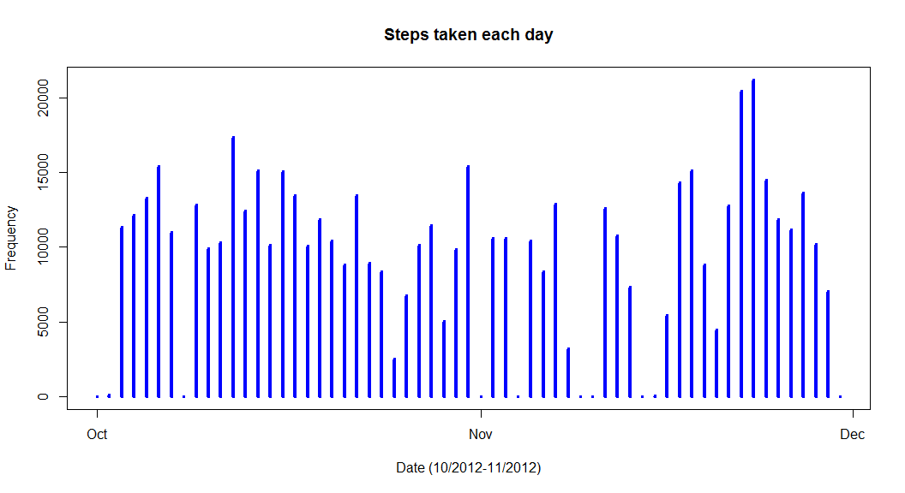
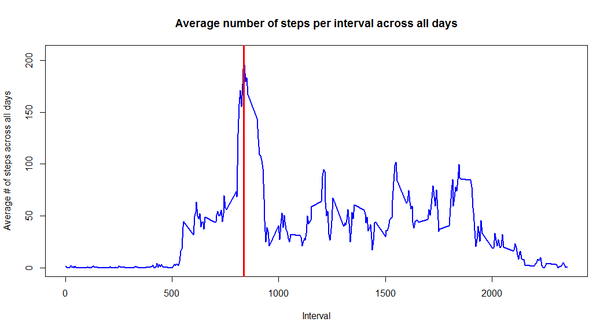
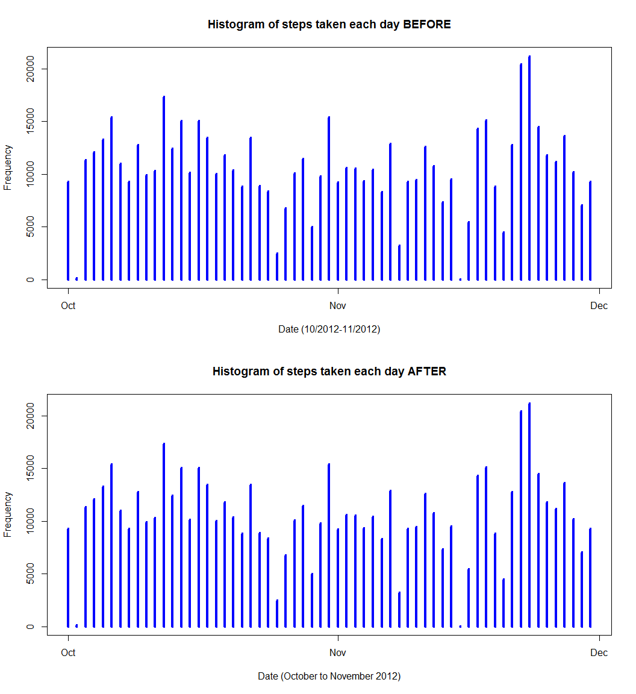

# Reproducible Research: Peer Assessment No. 1
Bob Wothe  
Friday, March 13, 2015  
##LOADING AND PREPROCESSING THE DATA

This code will load the data and also slightly transform the data for easier processing.


```r
unzip("repdata-data-activity.zip")
dat <- read.csv("activity.csv")

dates <- strptime(dat$date, "%Y-%m-%d")
dat$date <- dates

uniqueDates <- unique(dates)
uniqueIntervals <- unique(dat$interval)
```

##WHAT IS THE MEAN TOTAL NUMBER OF STEPS PER DAY?

1. This code will create a histogram of the total number of steps taken each day. 


```r
stepsSplit <- split(dat$steps, dates$yday)
totalStepsPerDay <- sapply(stepsSplit, sum, na.rm=TRUE)
plot(uniqueDates, totalStepsPerDay, main="Steps taken each day", 
     xlab="Date (10/2012-11/2012)", ylab="Frequency", type="h", lwd=4, col="blue")
```

 

2.a. This code will calculate mean steps per day: 


```r
meanStepsPerDay <- sapply(stepsSplit, mean, na.rm=TRUE)
meanDataFrame <- data.frame(date=uniqueDates, meanStepsPerDay=meanStepsPerDay, row.names=NULL)
meanDataFrame
```

```
##          date meanStepsPerDay
## 1  2012-10-01             NaN
## 2  2012-10-02       0.4375000
## 3  2012-10-03      39.4166667
## 4  2012-10-04      42.0694444
## 5  2012-10-05      46.1597222
## 6  2012-10-06      53.5416667
## 7  2012-10-07      38.2465278
## 8  2012-10-08             NaN
## 9  2012-10-09      44.4826389
## 10 2012-10-10      34.3750000
## 11 2012-10-11      35.7777778
## 12 2012-10-12      60.3541667
## 13 2012-10-13      43.1458333
## 14 2012-10-14      52.4236111
## 15 2012-10-15      35.2048611
## 16 2012-10-16      52.3750000
## 17 2012-10-17      46.7083333
## 18 2012-10-18      34.9166667
## 19 2012-10-19      41.0729167
## 20 2012-10-20      36.0937500
## 21 2012-10-21      30.6284722
## 22 2012-10-22      46.7361111
## 23 2012-10-23      30.9652778
## 24 2012-10-24      29.0104167
## 25 2012-10-25       8.6527778
## 26 2012-10-26      23.5347222
## 27 2012-10-27      35.1354167
## 28 2012-10-28      39.7847222
## 29 2012-10-29      17.4236111
## 30 2012-10-30      34.0937500
## 31 2012-10-31      53.5208333
## 32 2012-11-01             NaN
## 33 2012-11-02      36.8055556
## 34 2012-11-03      36.7048611
## 35 2012-11-04             NaN
## 36 2012-11-05      36.2465278
## 37 2012-11-06      28.9375000
## 38 2012-11-07      44.7326389
## 39 2012-11-08      11.1770833
## 40 2012-11-09             NaN
## 41 2012-11-10             NaN
## 42 2012-11-11      43.7777778
## 43 2012-11-12      37.3784722
## 44 2012-11-13      25.4722222
## 45 2012-11-14             NaN
## 46 2012-11-15       0.1423611
## 47 2012-11-16      18.8923611
## 48 2012-11-17      49.7881944
## 49 2012-11-18      52.4652778
## 50 2012-11-19      30.6979167
## 51 2012-11-20      15.5277778
## 52 2012-11-21      44.3993056
## 53 2012-11-22      70.9270833
## 54 2012-11-23      73.5902778
## 55 2012-11-24      50.2708333
## 56 2012-11-25      41.0902778
## 57 2012-11-26      38.7569444
## 58 2012-11-27      47.3819444
## 59 2012-11-28      35.3576389
## 60 2012-11-29      24.4687500
## 61 2012-11-30             NaN
```

2.b. This code will calculate median steps per day:

```r
medianStepsPerDay <- sapply(stepsSplit, median, na.rm=TRUE)
medianDataFrame <- data.frame(date=uniqueDates, medianStepsPerDay=medianStepsPerDay, row.names=NULL)
medianDataFrame
```

```
##          date medianStepsPerDay
## 1  2012-10-01                NA
## 2  2012-10-02                 0
## 3  2012-10-03                 0
## 4  2012-10-04                 0
## 5  2012-10-05                 0
## 6  2012-10-06                 0
## 7  2012-10-07                 0
## 8  2012-10-08                NA
## 9  2012-10-09                 0
## 10 2012-10-10                 0
## 11 2012-10-11                 0
## 12 2012-10-12                 0
## 13 2012-10-13                 0
## 14 2012-10-14                 0
## 15 2012-10-15                 0
## 16 2012-10-16                 0
## 17 2012-10-17                 0
## 18 2012-10-18                 0
## 19 2012-10-19                 0
## 20 2012-10-20                 0
## 21 2012-10-21                 0
## 22 2012-10-22                 0
## 23 2012-10-23                 0
## 24 2012-10-24                 0
## 25 2012-10-25                 0
## 26 2012-10-26                 0
## 27 2012-10-27                 0
## 28 2012-10-28                 0
## 29 2012-10-29                 0
## 30 2012-10-30                 0
## 31 2012-10-31                 0
## 32 2012-11-01                NA
## 33 2012-11-02                 0
## 34 2012-11-03                 0
## 35 2012-11-04                NA
## 36 2012-11-05                 0
## 37 2012-11-06                 0
## 38 2012-11-07                 0
## 39 2012-11-08                 0
## 40 2012-11-09                NA
## 41 2012-11-10                NA
## 42 2012-11-11                 0
## 43 2012-11-12                 0
## 44 2012-11-13                 0
## 45 2012-11-14                NA
## 46 2012-11-15                 0
## 47 2012-11-16                 0
## 48 2012-11-17                 0
## 49 2012-11-18                 0
## 50 2012-11-19                 0
## 51 2012-11-20                 0
## 52 2012-11-21                 0
## 53 2012-11-22                 0
## 54 2012-11-23                 0
## 55 2012-11-24                 0
## 56 2012-11-25                 0
## 57 2012-11-26                 0
## 58 2012-11-27                 0
## 59 2012-11-28                 0
## 60 2012-11-29                 0
## 61 2012-11-30                NA
```

##WHAT IS THE AVERAGE DAILY ACTIVITY PATTERN?

1. This code will create a time series plot (i.e. type = "l") of the 5-minute interval (x-axis) and the average number of steps taken, averaged across all days (y-axis)


```r
intervalSplit <- split(dat$steps, dat$interval)
averageStepsPerInterval <- sapply(intervalSplit, mean, na.rm=TRUE)
plot(uniqueIntervals, averageStepsPerInterval, type="l",
     main="Average number of steps per interval across all days", 
     xlab="Interval", ylab="Average # of steps across all days", 
     lwd=2, col="blue")
maxIntervalDays <- max(averageStepsPerInterval, na.rm=TRUE)
maxIndex <- as.numeric(which(averageStepsPerInterval == maxIntervalDays))
maxInterval <- uniqueIntervals[maxIndex]
abline(v=maxInterval, col="red", lwd=3)
```

 

2. This codw will return the 5-minute interval, on average across all the days in the dataset, that contains the maximum number of steps:


```r
maxInterval
```

```
## [1] 835
```

##INPUTTING MISSING VALUES

1. This code will calculate and report the total number of missing values in the dataset (i.e. the total number of rows with NAs)


```r
completeRowsBool <- complete.cases(dat$steps)
numNA <- sum(as.numeric(!completeRowsBool))
numNA
```

```
## [1] 2304
```

2/3. This code will fill in all of the missing values in the dataset using the mean for that day and create a new dataset that is equal to the original dataset but with the missing data filled in.


```r
meanStepsPerDay[is.nan(meanStepsPerDay)] <- 0

meanColumn <- rep(meanStepsPerDay, 288)

rawSteps <- dat$steps

stepsNA <- is.na(rawSteps)

rawSteps[stepsNA] <- meanColumn[stepsNA]

datNew <- dat
datNew$steps <- rawSteps
```

This histogram will show the total number of steps taken each day and Calculate and report the mean and median total number of steps taken per day. Do these values differ from the estimates from the first part of the assignment? What is the impact of imputing missing data on the estimates of the total daily number of steps?


```r
stepsSplitNew <- split(datNew$steps, dates$yday)

totalStepsPerDayNew <- sapply(stepsSplitNew, sum)

par(mfcol=c(2,1))

plot(uniqueDates, totalStepsPerDayNew, main="Histogram of steps taken each day", 
     xlab="Date (10/2012-11/2012)", ylab="Frequency", type="h", lwd=4, col="blue")
```

 

Mean steps:


```r
meanStepsPerDayNew <- sapply(stepsSplitNew, mean)
meanDataFrameNew <- data.frame(date=uniqueDates, meanStepsPerDay=meanStepsPerDay, 
                               meanStepsPerDayNew=meanStepsPerDayNew, row.names=NULL)
meanDataFrameNew
```

```
##          date meanStepsPerDay meanStepsPerDayNew
## 1  2012-10-01       0.0000000         32.3355276
## 2  2012-10-02       0.4375000          0.4375000
## 3  2012-10-03      39.4166667         39.4166667
## 4  2012-10-04      42.0694444         42.0694444
## 5  2012-10-05      46.1597222         46.1597222
## 6  2012-10-06      53.5416667         53.5416667
## 7  2012-10-07      38.2465278         38.2465278
## 8  2012-10-08       0.0000000         32.2632378
## 9  2012-10-09      44.4826389         44.4826389
## 10 2012-10-10      34.3750000         34.3750000
## 11 2012-10-11      35.7777778         35.7777778
## 12 2012-10-12      60.3541667         60.3541667
## 13 2012-10-13      43.1458333         43.1458333
## 14 2012-10-14      52.4236111         52.4236111
## 15 2012-10-15      35.2048611         35.2048611
## 16 2012-10-16      52.3750000         52.3750000
## 17 2012-10-17      46.7083333         46.7083333
## 18 2012-10-18      34.9166667         34.9166667
## 19 2012-10-19      41.0729167         41.0729167
## 20 2012-10-20      36.0937500         36.0937500
## 21 2012-10-21      30.6284722         30.6284722
## 22 2012-10-22      46.7361111         46.7361111
## 23 2012-10-23      30.9652778         30.9652778
## 24 2012-10-24      29.0104167         29.0104167
## 25 2012-10-25       8.6527778          8.6527778
## 26 2012-10-26      23.5347222         23.5347222
## 27 2012-10-27      35.1354167         35.1354167
## 28 2012-10-28      39.7847222         39.7847222
## 29 2012-10-29      17.4236111         17.4236111
## 30 2012-10-30      34.0937500         34.0937500
## 31 2012-10-31      53.5208333         53.5208333
## 32 2012-11-01       0.0000000         32.0149498
## 33 2012-11-02      36.8055556         36.8055556
## 34 2012-11-03      36.7048611         36.7048611
## 35 2012-11-04       0.0000000         32.4504726
## 36 2012-11-05      36.2465278         36.2465278
## 37 2012-11-06      28.9375000         28.9375000
## 38 2012-11-07      44.7326389         44.7326389
## 39 2012-11-08      11.1770833         11.1770833
## 40 2012-11-09       0.0000000         32.3078945
## 41 2012-11-10       0.0000000         32.8706718
## 42 2012-11-11      43.7777778         43.7777778
## 43 2012-11-12      37.3784722         37.3784722
## 44 2012-11-13      25.4722222         25.4722222
## 45 2012-11-14       0.0000000         32.9865210
## 46 2012-11-15       0.1423611          0.1423611
## 47 2012-11-16      18.8923611         18.8923611
## 48 2012-11-17      49.7881944         49.7881944
## 49 2012-11-18      52.4652778         52.4652778
## 50 2012-11-19      30.6979167         30.6979167
## 51 2012-11-20      15.5277778         15.5277778
## 52 2012-11-21      44.3993056         44.3993056
## 53 2012-11-22      70.9270833         70.9270833
## 54 2012-11-23      73.5902778         73.5902778
## 55 2012-11-24      50.2708333         50.2708333
## 56 2012-11-25      41.0902778         41.0902778
## 57 2012-11-26      38.7569444         38.7569444
## 58 2012-11-27      47.3819444         47.3819444
## 59 2012-11-28      35.3576389         35.3576389
## 60 2012-11-29      24.4687500         24.4687500
## 61 2012-11-30       0.0000000         32.2280213
```

Median steps:


```r
medianStepsPerDayNew <- sapply(stepsSplitNew, median)
medianDataFrameNew <- data.frame(date=uniqueDates, medianStepsPerDay=medianStepsPerDay, 
                                 medianStepsPerDayNew=medianStepsPerDayNew, row.names=NULL)
medianDataFrameNew
```

```
##          date medianStepsPerDay medianStepsPerDayNew
## 1  2012-10-01                NA             36.09375
## 2  2012-10-02                 0              0.00000
## 3  2012-10-03                 0              0.00000
## 4  2012-10-04                 0              0.00000
## 5  2012-10-05                 0              0.00000
## 6  2012-10-06                 0              0.00000
## 7  2012-10-07                 0              0.00000
## 8  2012-10-08                NA             36.09375
## 9  2012-10-09                 0              0.00000
## 10 2012-10-10                 0              0.00000
## 11 2012-10-11                 0              0.00000
## 12 2012-10-12                 0              0.00000
## 13 2012-10-13                 0              0.00000
## 14 2012-10-14                 0              0.00000
## 15 2012-10-15                 0              0.00000
## 16 2012-10-16                 0              0.00000
## 17 2012-10-17                 0              0.00000
## 18 2012-10-18                 0              0.00000
## 19 2012-10-19                 0              0.00000
## 20 2012-10-20                 0              0.00000
## 21 2012-10-21                 0              0.00000
## 22 2012-10-22                 0              0.00000
## 23 2012-10-23                 0              0.00000
## 24 2012-10-24                 0              0.00000
## 25 2012-10-25                 0              0.00000
## 26 2012-10-26                 0              0.00000
## 27 2012-10-27                 0              0.00000
## 28 2012-10-28                 0              0.00000
## 29 2012-10-29                 0              0.00000
## 30 2012-10-30                 0              0.00000
## 31 2012-10-31                 0              0.00000
## 32 2012-11-01                NA             35.93576
## 33 2012-11-02                 0              0.00000
## 34 2012-11-03                 0              0.00000
## 35 2012-11-04                NA             36.17014
## 36 2012-11-05                 0              0.00000
## 37 2012-11-06                 0              0.00000
## 38 2012-11-07                 0              0.00000
## 39 2012-11-08                 0              0.00000
## 40 2012-11-09                NA             35.93576
## 41 2012-11-10                NA             36.09375
## 42 2012-11-11                 0              0.00000
## 43 2012-11-12                 0              0.00000
## 44 2012-11-13                 0              0.00000
## 45 2012-11-14                NA             36.09375
## 46 2012-11-15                 0              0.00000
## 47 2012-11-16                 0              0.00000
## 48 2012-11-17                 0              0.00000
## 49 2012-11-18                 0              0.00000
## 50 2012-11-19                 0              0.00000
## 51 2012-11-20                 0              0.00000
## 52 2012-11-21                 0              0.00000
## 53 2012-11-22                 0              0.00000
## 54 2012-11-23                 0              0.00000
## 55 2012-11-24                 0              0.00000
## 56 2012-11-25                 0              0.00000
## 57 2012-11-26                 0              0.00000
## 58 2012-11-27                 0              0.00000
## 59 2012-11-28                 0              0.00000
## 60 2012-11-29                 0              0.00000
## 61 2012-11-30                NA             35.93576
```

The impact of the missing data is minimal; this is likely due to an already representative sample being established.

##ARE THERE DIFFERENCES IN ACTIVITY PATTERNS BETWEEN WEEKDAYS AND WEEKENDS?

1. This code will create a new factor variable in the dataset with two levels - "weekday" and "weekend" indicating whether a given date is a weekday or weekend day.


```r
wdays <- dates$wday

classifywday <- rep(0, 17568)

classifywday[wdays >= 1 & wdays <= 5] <- 1

classifywday[wdays == 6 | wdays == 0] <- 2

daysFactor <- factor(classifywday, levels=c(1,2), labels=c("Weekdays", "Weekends"))

datNew$typeOfDay <- daysFactor

datWeekdays <- datNew[datNew$typeOfDay == "Weekdays", ]
datWeekends <- datNew[datNew$typeOfDay == "Weekends", ]
```

2. This code will create two panel plots containing a time series plot (i.e. type = "l") of the 5-minute interval (x-axis) and the average number of steps taken, averaged across all weekday days and weekend days (y-axis). 


```r
datSplitWeekdays <- split(datWeekdays$steps, datWeekdays$interval)
datSplitWeekends <- split(datWeekends$steps, datWeekends$interval)

meanStepsPerWeekdayInterval <- sapply(datSplitWeekdays, mean)
meanStepsPerWeekendInterval <- sapply(datSplitWeekends, mean)

par(mfcol=c(2,1))
plot(uniqueIntervals, meanStepsPerWeekdayInterval, type="l",
     main="Average number of steps per interval - weekdays", 
     xlab="Interval", ylab="Average # of steps - weekdays", 
     lwd=2, col="blue")
plot(uniqueIntervals, meanStepsPerWeekendInterval, type="l",
     main="Average number of steps per interval - weekends", 
     xlab="Interval", ylab="Average # of steps - weekends", 
     lwd=2, col="blue")
```

 
